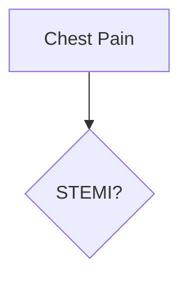

# Open Medical Library of Thailand (ThaiOML)

**Open Medical Library of Thailand** ([thaioml.org](https://www.thaioml.org)) is a community-maintained, expert-reviewed medical education database. The contents cater toward medical students.

---

## Purpose

Goals:

* Public medical knowledge library
* Thousands of short articles
* Multi-author workflow (medical students)
* WYSIWYG editing experience
* Static publishing
* Structured metadata
* Abbreviation disambiguation
* AI-ready (RAG)
* Low operational complexity
* Deployable within 6 months

---

# Core Principles

## Governance

ThaiOML is independent from any medical schools or universities (currently managed by Sira Pornsiriprasert). Medical schools contribute to the project and contents as "Collaborators". For example, if the Student Council of Faculty of Medicine Ramathibodi Hospital were to join the project, "ThaiOML - Ramathibodi" would be defined under ThaiOML. The head of the branch is assigned a "Co-chairperson" with their own team of editors, reviewers, and contributors. ThaiOML governs the branches under a unified direction.

## Language

The content are mainly in English. For each page, contributors are invited to translate the pages to Thai. Mnemonics are allowed to be solely in Thai.

## Medical Practice Priority

Thai medical knowledge and guidelines are prioritized over US or other data.

Medical guidelines are encouraged to be submitted to the system to save into vectorized database. (Does this violate copyright?)

## Source of Truth

The Git repository is the single source of truth.

All published content, indexes, embeddings, and AI retrieval artifacts originate from repository content, including the design principles, guidelines, and governance, aiming for a highly transparent independent organization.

No content should exist exclusively inside a CMS database.

---

## Markdown First

Canonical storage format:

```text
Markdown + YAML Frontmatter
```

Reasons:

* Portable
* Version-controlled
* AI-friendly
* Easy export
* Long-term durability

---

## Static First

The public website is generated statically.

Avoid:

* Runtime page generation
* CMS-dependent rendering
* Dynamic content databases

Benefits:

* Faster
* Cheaper
* More secure
* Easier to cache globally

---

# Architecture Overview

```text
Authors
    ↓
Decap CMS
    ↓
GitHub Repository
    ↓
GitHub Actions
    ├── MkDocs Build
    ├── Validation
    └── RAG Ingestion
            ↓
        PostgreSQL + pgvector

Public Site
    ↓
Cloudflare Pages

AI Search
    ↓
Cloudflare Worker
    ↓
RAG API
```

---

# Technology Stack

## Source Control

GitHub

Responsibilities:

* Repository hosting
* Pull requests
* Code review
* Editorial workflow
* CI/CD triggers
* Issue tracking

---

## CMS

Decap CMS

Purpose:

* WYSIWYG editing
* Metadata forms
* Contributor-friendly workflow

Requirements:

* Authors should not edit raw Markdown directly.
* Authors should not manage YAML manually.
* Metadata fields are exposed through forms.

---

## Documentation Site

MkDocs

Theme:

```text
Material for MkDocs
```

Features:

* Navigation
* Search
* Mermaid support
* Responsive design
* Markdown native

---

## Hosting

Cloudflare Pages

Purpose:

* Static site hosting
* Global CDN
* Preview deployments
* Custom domain support

---

## Edge Layer

Cloudflare Workers

Purpose:

* API gateway
* AI search endpoint
* Rate limiting
* Authentication (future)

---

## Object Storage (Future)

Cloudflare R2

Use cases:

* Images
* PDFs
* Large media assets

Not required for MVP.

---

# Content Model

TODO: To be finalized

Every article must contain metadata.

Example:

```yaml
id: neuro-multiple-sclerosis

title: Multiple Sclerosis

type: disease

specialty:
  - neurology

abbreviations:
  - MS

tags:
  - autoimmune
  - demyelinating

review_status: reviewed

last_medical_review: 2026-01-15
```

---

# Article Types

TODO: To be finalized

Allowed content types:

* disease
* drug
* procedure
* anatomy
* physiology
* symptom
* laboratory-test
* guideline
* abbreviation
* differential-diagnosis

---

# Abbreviation System

## Principle

Abbreviations are entities.

They are not plain text.

---

## Example

MS can mean:

* Multiple Sclerosis
* Mitral Stenosis
* Morphine Sulfate

Create:

```text
/content/abbreviations/MS.md
```

Example:

```yaml
type: abbreviation

term: MS

meanings:
  - neuro-multiple-sclerosis
  - cardio-mitral-stenosis
  - pharm-morphine-sulfate
```

---

## Build Rules

Build process should:

1. Validate abbreviation registry
2. Detect collisions
3. Generate disambiguation pages
4. Generate abbreviation index

---

# Flowcharts

Standard:



Figures in picture format (like png and jpg) are allowed, but best accompanied by mermaid diagrams to help the system parses and understands the figures.

---

# Query Tables

Query tables are generated at build time.

Examples:

* All neurology diseases
* All antibiotics
* All ICU topics
* All cardiology procedures

No runtime database queries.

---

# Editorial Workflow

## Contributor

Creates or edits article.

## Reviewer

Reviews medical accuracy.

## Maintainer

Approves merge.

Workflow:

```text
Contributor
    ↓
Pull Request
    ↓
Medical Review
    ↓
Approval
    ↓
Merge
```

---

# Validation Pipeline

Every pull request must pass:

## Metadata Validation

Required fields present.

## Link Validation

No broken internal links.

## Abbreviation Validation

No undefined abbreviations.

## Build Validation

MkDocs build succeeds.

---

# RAG Architecture

## Principle

RAG is separate from publishing.

Publishing must not depend on AI systems.

---

## Ingestion Pipeline

Markdown
↓
Chunking
↓
Embedding
↓
pgvector

---

## Chunking Strategy

Preferred boundaries:

1. Heading sections
2. Clinical subsections
3. 300–800 token windows

Metadata preserved:

```json
{
  "doc_id": "...",
  "title": "...",
  "specialty": "...",
  "section": "...",
  "type": "..."
}
```

---

# Vector Database

Database:

```text
PostgreSQL
```

Extension:

```text
pgvector
```

Reasons:

* Mature
* Cheap
* Simple
* Portable

Avoid dedicated vector databases for MVP.

---

# AI Search

Architecture:

```text
User
 ↓
Cloudflare Worker
 ↓
RAG API
 ↓
pgvector
 ↓
LLM
```

Requirements:

* Source citations
* Retrieved passages
* No uncited answers

---

# MVP Scope

Included:

* Decap CMS
* GitHub
* MkDocs
* Cloudflare Pages
* GitHub Actions
* PostgreSQL + pgvector
* Basic RAG

Excluded:

* Dynamic filtering UI
* Personalized recommendations
* Graph database
* Semantic auto-disambiguation

---

# Final Stack Summary

Authoring:

* Decap CMS

Storage:

* GitHub

Site Generation:

* MkDocs + Material

Hosting:

* Cloudflare Pages

CI/CD:

* GitHub Actions

AI Retrieval:

* FastAPI

Vector Storage:

* PostgreSQL + pgvector

Edge/API:

* Cloudflare Workers

Canonical Content Format:

* Markdown + YAML Frontmatter
